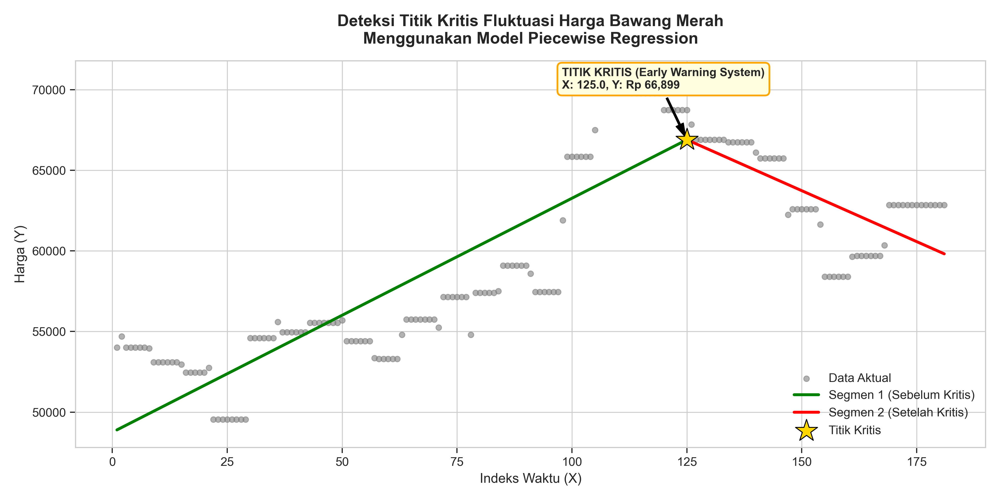
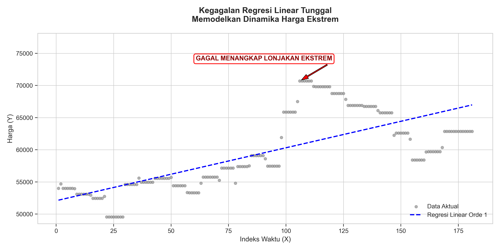
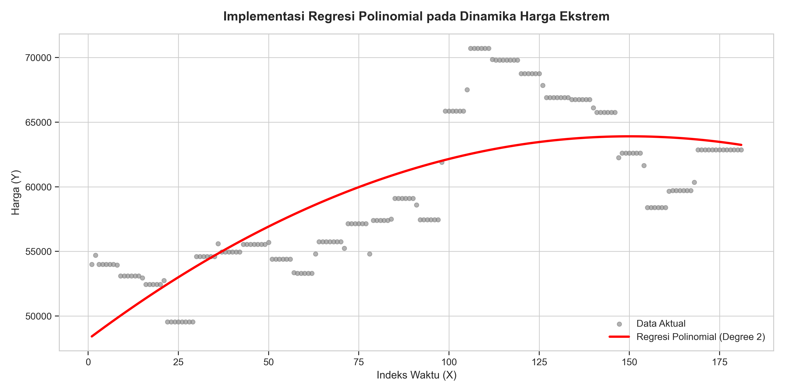
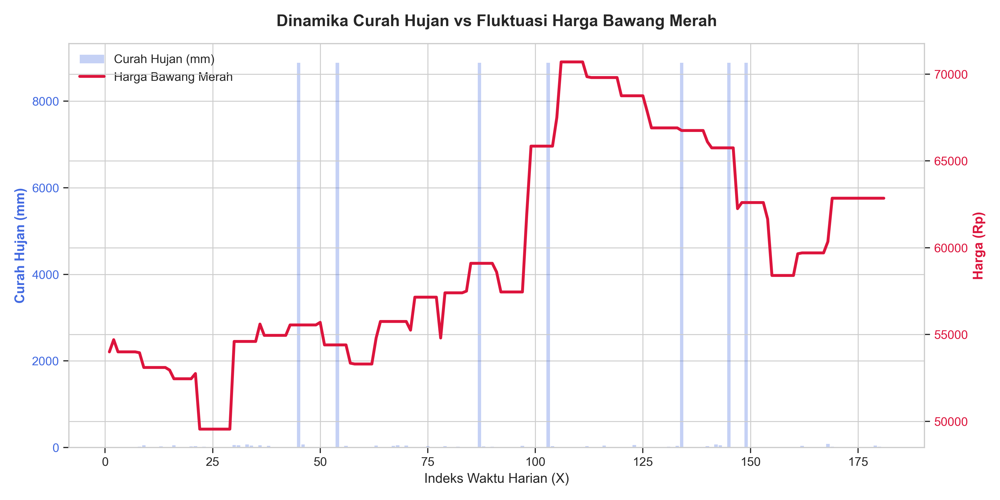

# Commodity Price Intelligence

## Early Warning System for Shallot Price Fluctuation Using Piecewise Regression and Climate Data Analysis

This project analyzes shallot (bawang merah) price fluctuations using several regression techniques and investigates the influence of rainfall on commodity prices.

---

## Features

- Piecewise Regression for critical breakpoint detection
- Linear Regression baseline model
- Polynomial Regression (Degree 2)
- Rainfall and price correlation analysis
- Automatic graph generation
- Statistical evaluation using R² and RMSE

---

## Algorithms Used

### 1. Piecewise Regression

Piecewise Regression is used to identify critical points (breakpoints) where the price trend changes significantly.

Outputs:

- Critical breakpoint detection
- Early warning indicator
- Two-segment trend analysis

---

### 2. Linear Regression

Used as a baseline model to evaluate overall trends.

Outputs:

- Linear trend line
- Residual analysis
- Model performance metrics

---

### 3. Polynomial Regression

Polynomial Regression (Degree 2) is used to capture nonlinear price patterns.

Outputs:

- Smoothed trend curve
- Better representation of extreme fluctuations

---

### 4. Climate Correlation Analysis

Daily rainfall (RR) data is integrated with commodity prices.

Outputs:

- Rainfall vs Price visualization
- Climate influence analysis

---

## Project Structure

```text
commodity-price-intelligence/
│
├── data/
│   ├── data_bersih_XY.csv
│   └── laporan_iklim_harian_jan_jun.csv
│
├── output/
│   ├── grafik_piecewise.png
│   ├── grafik_linear_failure.png
│   ├── grafik_polynomial.png
│   └── grafik_hujan_harga.png
│
├── src/
│   └── main.py
│
├── requirements.txt
├── README.md
├── LICENSE
└── .gitignore
```

---

## Installation

Clone repository:

```bash
git clone https://github.com/zurisey/commodity-price-intelligence.git
```

Move into project directory:

```bash
cd commodity-price-intelligence
```

Install required packages:

```bash
pip install -r requirements.txt
```

---

## Usage

Place datasets inside the `data` folder.

Run the program:

```bash
python src/main.py
```

---

## Generated Outputs

The program automatically generates:

- Piecewise Regression Visualization
- Linear Regression Failure Analysis
- Polynomial Regression Visualization
- Rainfall vs Price Analysis

inside the `output` folder.

---

## Example Results

### Piecewise Regression



### Linear Regression Failure



### Polynomial Regression



### Rainfall vs Price



---

## Evaluation Metrics

The system reports:

- R² Score
- RMSE
- Critical Breakpoint Location
- Critical Price Value

---

## Technologies

- Python
- Pandas
- NumPy
- Matplotlib
- Seaborn
- Scikit-Learn

---

## Author

M. Ibrahim Zuhri

---

## License

This project is licensed under the MIT License.
